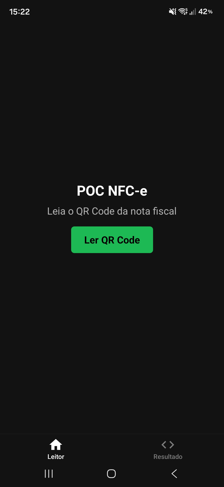
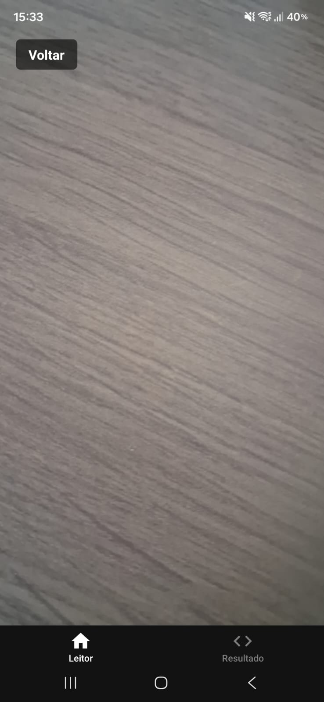
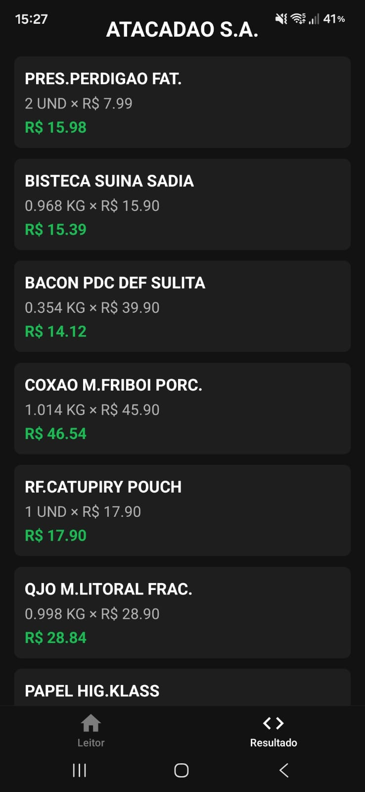

# NFC-e POC


POC para validar a leitura de QR Code de NFC-e, coleta dos dados diretamente na SEFAZ e exibição dos itens no celular.

O foco não é produto final. A ideia era descobrir se a cadeia completa — câmera → backend → SEFAZ → tela — funcionava de verdade.

---

## O que foi validado

- Leitura do QR Code via câmera do celular
- Comunicação entre o app mobile e o backend local
- Extração dos dados do HTML da SEFAZ com Cheerio
- Exibição dos itens da nota com nome, quantidade e valor

## Screenshots

| Leitor                                                           | Câmera                                                              | Resultado                                                          |
| ---------------------------------------------------------------- | ------------------------------------------------------------------- | ------------------------------------------------------------------ |
|  |  |  |

---

## Stack

**Frontend (Mobile)**

- React Native + Expo
- TypeScript
- Expo Router
- Expo Camera

**Backend**

- Node.js + TypeScript
- Express
- Cheerio

**Infra**

- Cloudflare Tunnel

---

## Arquitetura

```
[App Mobile - Expo]
        |
        | POST /nfce (URL da NFC-e)
        v
[Backend Node.js + TypeScript]
        |
        | HTTP GET (SEFAZ PR)
        v
[HTML da NFC-e]
        |
        | Parser (Cheerio)
        v
[JSON estruturado]
```

---

## Estrutura

```
nfce-POC/
├── poc-backend/
│   └── src/
│       ├── fetchNfce.ts   — busca o HTML da NFC-e via URL
│       ├── parseNfce.ts   — extrai estabelecimento e itens do HTML
│       └── server.ts      — API Express com endpoint POST /nfce
│
└── poc-frontend/
    └── app/
        └── (tabs)/
            ├── index.tsx  — tela de leitura do QR Code
            └── result.tsx — tela de resultado
```

---

## Como rodar

### 1. Backend

```bash
cd poc-backend
npm install
npm run start:dev
```

O servidor sobe em `http://localhost:3333` com um endpoint:

```
POST /nfce
```

```json
{ "url": "http://www.fazenda.pr.gov.br/nfce/qrcode?p=..." }
```

### 2. Cloudflare Tunnel

O app roda no celular e não acessa `localhost` diretamente. O tunnel resolve isso expondo o backend via URL pública.

```bash
npm install -g cloudflared
cloudflared tunnel --url http://localhost:3333
```

Você receberá uma URL como:

```
https://exemplo-gerado.trycloudflare.com
```

Essa URL muda toda vez que o tunnel é reiniciado.

### 3. Configurar a URL no frontend

Copie o arquivo de exemplo:

```bash
cp poc-frontend/constants/config.example.ts poc-frontend/constants/config.ts
```

Abra `config.ts` e substitua pela URL gerada no passo anterior:

```ts
export const API_URL = "https://sua-url-gerada.trycloudflare.com/nfce";
```

### 4. Frontend

```bash
cd poc-frontend
npm install
npm start
```

Abra o **Expo Go** no celular e escaneie o QR Code exibido no terminal.

---

## Fluxo

1. Usuário abre o app e toca em **Ler QR Code**
2. Câmera abre e escaneia o QR da NFC-e
3. App envia a URL para o backend
4. Backend acessa a SEFAZ PR e recebe o HTML da nota
5. Cheerio extrai os dados do HTML
6. Backend retorna JSON com estabelecimento e itens
7. App exibe o resultado na tela
